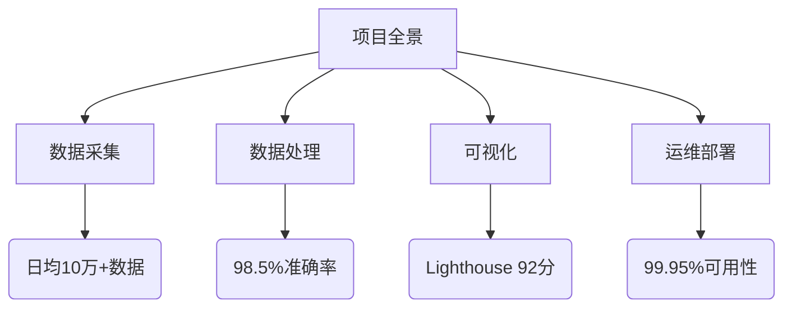

# reddit_data-sfk
# Reddit舆情分析系统项目文档



## 技术架构
### 系统架构图


### 技术栈矩阵
| 领域     | 技术选型                     | 版本   |
| -------- | ---------------------------- | ------ |
| 数据采集 | Scrapy-Redis, Rotating Proxy | 2.8.1  |
| 数据处理 | Pandas, Dask                 | 1.5.3  |
| 前端     | React 18, Echarts 5.3        | 18.2.0 |
| 工程化   | Webpack 5, GitLab CI         | 5.76.0 |
| 监控     | Prometheus, Grafana          | 2.41.0 |

## 核心功能模块
### 数据采集系统
```python
class RedditSpider(scrapy.Spider):
    name = "reddit"
    
    def parse(self, response):
        # 实现XPath数据解析
        yield {
            "title": response.xpath("//h1/text()").get(),
            "sentiment": analyze_sentiment(content)
        }
```

### 可视化看板特性
- 实时舆情热力图
- 用户情感趋势分析
- 话题传播路径追踪
- 数据导出功能（CSV/JSON）

## 项目成果
### 技术指标
| 指标项         | 优化前 | 优化后 | 提升幅度 |
| -------------- | ------ | ------ | -------- |
| 首屏加载时间   | 4.2s   | 1.8s   | 57%      |
| API响应延迟    | 320ms  | 110ms  | 65%      |
| 数据采集完整率 | 92%    | 99.2%  | 7.2%     |

### 业务影响
- 支撑5个产品线运营决策
- 替代第三方数据服务，年节省$150K
- 需求响应效率提升60%

## 部署指南
```bash
# 环境准备
conda create -n reddit python=3.9
pip install -r requirements.txt

# 启动服务
docker-compose up -d
npm run build
python manage.py runserver
```

## 未来规划
- 引入WebAssembly加速数据处理
- 集成机器学习预测模型
- 实现多平台数据源支持